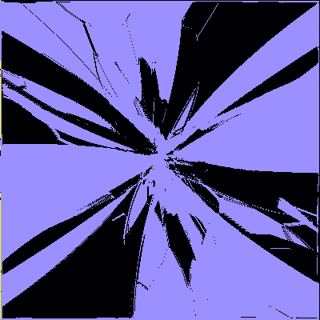
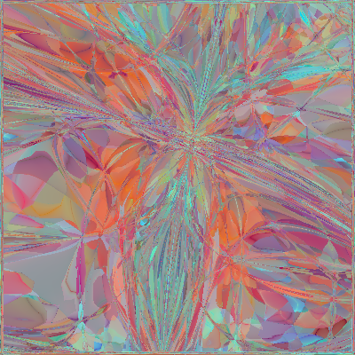
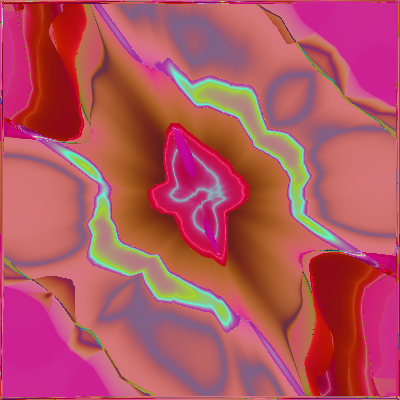
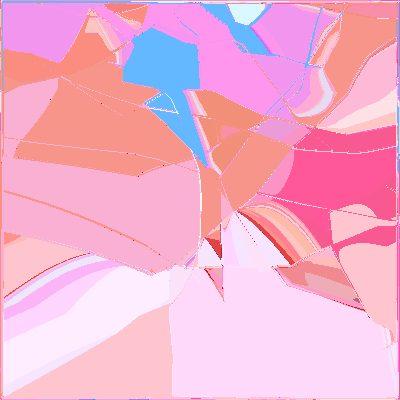

# neural-painter-pytorch
This is pytorch version of painting with neural network

It is a trial of NN art generation several years ago. With the state of art NN struture, maybe we can create more beautiful patterns.

### demo example

### Reference 
1. [neural-painter](https://github.com/zxytim/neural-painter)
2. [npainter](https://github.com/rupeshs/npainter)
